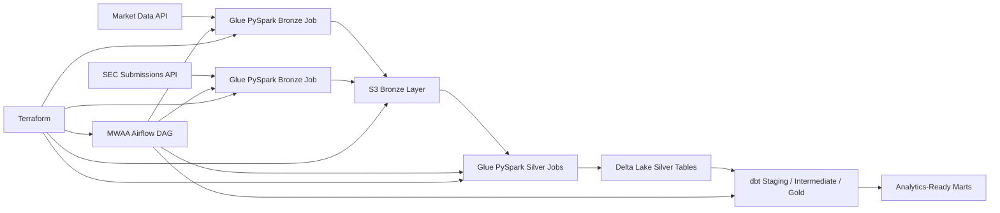

# Finance Data Lakehouse

Recruiter-ready AWS finance lakehouse project built around the stack described in the resume entry: AWS, Glue PySpark, Delta Lake, dbt, Airflow on MWAA, CI/CD, and Terraform-based infrastructure as code.

## What This Project Demonstrates

- AWS-centered medallion lakehouse architecture across Bronze, Silver, and Gold layers.
- Glue-oriented ingestion and curation jobs for market and SEC submission datasets.
- Delta Lake write and merge semantics for curated Silver datasets.
- dbt semantic modeling, seeds, and broad data quality coverage for Gold marts.
- MWAA-style Airflow orchestration coordinating Glue jobs and dbt execution.
- Terraform-managed platform resources including S3, IAM, Glue, and MWAA.
- GitHub Actions CI validating Python assets and repository structure.

## Architecture



## Repository Layout

- `src/finance_lakehouse/`: Shared Python code, Glue-style jobs, Delta helpers, and runtime config.
- `dags/`: Airflow DAG for orchestration on MWAA.
- `dbt/finance_lakehouse/`: dbt project with seeds, staging, intermediate, marts, and schema tests.
- `infrastructure/terraform/`: Terraform for S3, IAM, Glue jobs, and MWAA.
- `docs/`: Architecture and deployment notes.
- `.github/workflows/`: CI checks.
- `tests/`: Python unit tests covering core platform helpers and job payload construction.

## Implemented Stack Mapping

| Resume technology | Implemented in repo |
| --- | --- |
| AWS | S3, IAM, Glue, Glue Catalog, CloudWatch, MWAA modeled in Terraform |
| Glue PySpark | Bronze and Silver job entrypoints plus Glue deployment artifacts |
| Delta Lake | Silver-layer Delta table layout, merge keys, registration SQL, and write options |
| dbt | Staging, intermediate, marts, seeds, and schema-driven data tests |
| Airflow / MWAA | Daily DAG with Bronze, Silver, and dbt orchestration flow |
| CI/CD | GitHub Actions workflow for Python validation and repository checks |
| IaC | Terraform resources and example `terraform.tfvars` |

## Quick Start

1. Create a virtual environment and install local tooling:

   ```powershell
   python -m venv .venv
   .\.venv\Scripts\Activate.ps1
   pip install -e .[dev]
   ```

2. Copy environment variables:

   ```powershell
   Copy-Item .env.example .env
   ```

3. Run Python validation:

   ```powershell
   python -m pytest
   python -m ruff check . --no-cache
   ```

4. Review AWS deployment inputs:

   ```powershell
   Copy-Item infrastructure/terraform/terraform.tfvars.example infrastructure/terraform/terraform.tfvars
   ```

## Local Development Notes

- Python 3.11+ is the local development baseline.
- The Python job modules are designed to be testable locally while still mirroring Glue deployment artifacts.
- The DAG uses MWAA-friendly structure and can be adapted to `GlueJobOperator` or CLI-triggered wrappers depending on the target environment conventions.
- dbt is configured for local DuckDB development and can be adapted for Redshift, Snowflake, or Databricks targets.

## Verification

- Python unit tests cover helpers, runtime arg parsing, Bronze payload builders, Silver Delta payload builders, and curation logic.
- dbt includes broad schema tests across sources, seeds, and marts.
- CI runs repository-level validation on every push and pull request.

## Deployment

See [Architecture Notes](docs/architecture.md) and [Deployment Guide](docs/deployment.md) for platform notes and Terraform deployment steps.
