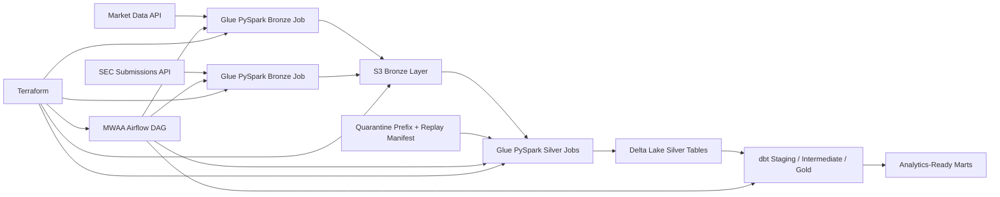

# Finance Data Lakehouse

Production-style finance lakehouse focused on platform reliability rather than dashboard polish.
This repository is framed like an analytics platform owned by a data engineer responsible for
replayable ingestion, Delta merge correctness, quarantine handling, and operational recovery on AWS.

## What This Project Actually Optimizes For

- Replayable Bronze and Silver ingestion with deterministic date-window backfills.
- Delta Lake merge semantics and layout decisions that support corrections instead of append-only drift.
- Quarantine and recovery mechanics for malformed payloads and partial job failures.
- MWAA-style orchestration that separates normal daily execution from replay workflows.
- Terraform-managed AWS platform resources with IAM and storage boundaries that resemble real platform ownership.
- CI and unit coverage around job payloads, runtime parsing, and operational helpers.

## Operating Model

The repo is intentionally built around platform concerns that tend to show up after the first
version of a pipeline is already in production:

- source payloads can arrive late or malformed,
- corrections must be replayed for bounded date windows,
- Silver tables need deterministic merge keys,
- failed slices should be quarantined instead of silently dropped,
- operators need manifests that tell them exactly what to rerun.

## Architecture



## Why This Feels Senior

- It treats ingestion as an operational system, not just a one-time transformation exercise.
- It includes explicit replay planning and quarantine behavior rather than assuming clean source data.
- It models how a team would reprocess a bounded incident window without rewriting unrelated partitions.
- It makes reliability and recovery first-class concerns in code and documentation.

## Repository Layout

- `src/finance_lakehouse/`: Shared Python code, Glue-style jobs, Delta helpers, runtime config, and recovery planning helpers.
- `dags/`: Airflow DAG for orchestration on MWAA.
- `dbt/finance_lakehouse/`: dbt project with seeds, staging, intermediate, marts, and schema tests.
- `infrastructure/terraform/`: Terraform for S3, IAM, Glue jobs, and MWAA.
- `docs/`: Architecture and deployment notes.
- `.github/workflows/`: CI checks.
- `tests/`: Python unit tests covering core platform helpers and job payload construction.

## Implemented Stack Mapping

| Resume technology | Implemented in repo |
| --- | --- |
| AWS | S3, IAM, Glue, Glue Catalog, CloudWatch, and MWAA modeled in Terraform |
| Glue PySpark | Bronze and Silver job entrypoints plus runtime argument parsing for bounded reprocessing |
| Delta Lake | Silver-layer layout, merge keys, optimize settings, and merge-safe table conventions |
| Airflow / MWAA | Daily DAG plus replay-aware job orchestration patterns |
| Platform Reliability | Quarantine classification, backfill planning, and replay manifests |
| dbt | Curated marts and semantic tests on top of replayable lakehouse outputs |
| IaC / CI | Terraform assets and GitHub Actions validation |

## Quick Start

1. Create a virtual environment and install local tooling:

   ```powershell
   python -m venv .venv
   .\.venv\Scripts\Activate.ps1
   pip install -e .[dev]
   ```

2. Copy environment variables:

   ```powershell
   Copy-Item .env.example .env
   ```

3. Run Python validation:

   ```powershell
   python -m pytest
   python -m ruff check . --no-cache
   ```

4. Review AWS deployment inputs:

   ```powershell
   Copy-Item infrastructure/terraform/terraform.tfvars.example infrastructure/terraform/terraform.tfvars
   ```

## Recovery Workflows

The repo now includes operational helpers that mirror the work of owning a production pipeline:

- `build_backfill_plan(...)` breaks a date-window replay into deterministic execution batches.
- `classify_records_for_quarantine(...)` separates malformed source rows from replayable good rows.
- `build_replay_manifest(...)` produces a compact operator-facing summary of what succeeded, failed, and should be rerun.

## Local Development Notes

- Python 3.11+ is the local development baseline.
- The Python job modules are designed to be testable locally while still mirroring Glue deployment artifacts.
- The Delta helpers and replay utilities are written to support deterministic backfills and incident response.
- The DAG uses MWAA-friendly structure and can be adapted to `GlueJobOperator` or CLI-triggered wrappers depending on the target environment conventions.
- dbt is configured for local DuckDB development and can be adapted for Redshift, Snowflake, or Databricks targets.

## Verification

- Python unit tests cover helpers, runtime arg parsing, Bronze payload builders, Silver Delta payload builders, curation logic, and replay/quarantine helpers.
- dbt includes broad schema tests across sources, seeds, and marts.
- CI runs repository-level validation on every push and pull request.

## Deployment

See [Architecture Notes](docs/architecture.md) and [Deployment Guide](docs/deployment.md) for platform notes and Terraform deployment steps.
